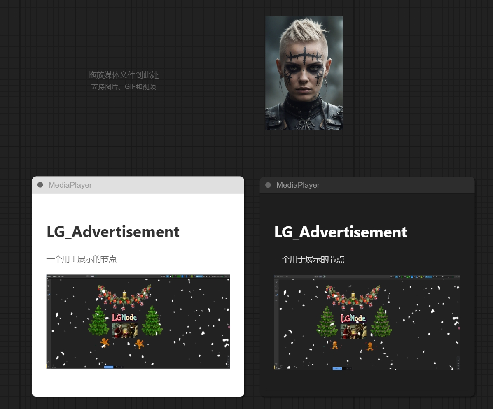

# LG_Advertisement
一个用于展示的节点
#

MediaPlayer支持markdown

url参考格式为：

https://github.com/LAOGOU-666/Comfyui_LG_Advertisement/blob/main/README.md

Advertisement节点

支持图片，GIF，MP4视频

支持手动上传，拖拽导入

支持在线，本地路径，绝对/相对路径（以comfyui根目录为相对路径根目录，不清楚什么意思的可以看我视频）

一定要看右键菜单！
一定要看右键菜单！
一定要看右键菜单！
#
* 商务联系VX : wenrulaogou2033

